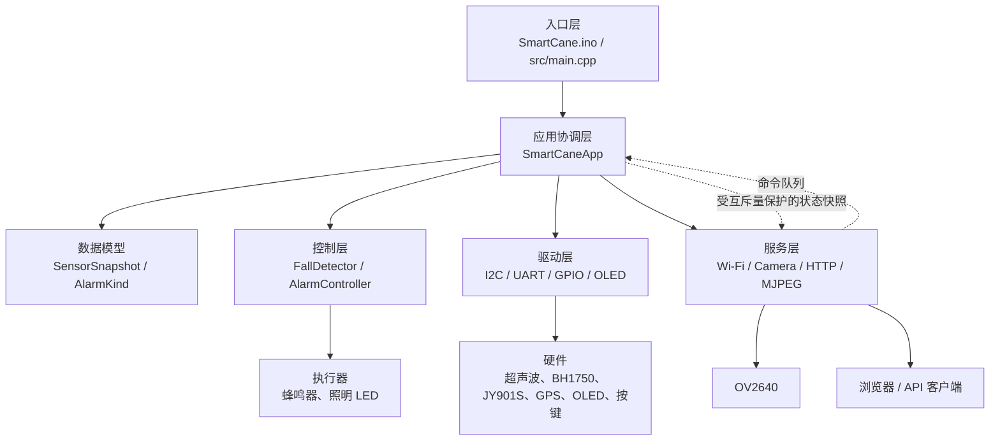
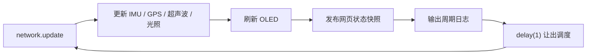

# SmartCane 工程架构与文件说明

> 本次集成验收只覆盖硬件驱动、原始数据通道、显示/执行器接口、串口、Wi-Fi图传和上位机。双核 FreeRTOS、跌倒检测和分级告警当前只保留空接口与中文 TODO，不包含基础实现。

## 1. 文档目的

本文面向需要阅读、维护或二次开发本工程的人员，说明：

- 工程实现了什么；
- 软件为什么这样分层；
- 系统从上电到稳定运行经历了什么；
- 传感器数据、告警命令和网页请求如何流动；
- 工程中每一个文件的职责以及修改边界。

配套的环境搭建、烧录和排错步骤见 [02-ESP32-Arduino开发与调试指南.md](./02-ESP32-Arduino开发与调试指南.md)。

## 2. 工程概况

SmartCane 是基于 **GOOUUU ESP32-S3-CAM + OV2640** 的智能导盲拐杖 Arduino 工程，使用 PlatformIO 组织和构建。当前功能包括：

- HC-SR04 2021 UART/IIC 版非阻塞测距；
- BH1750 环境照度采集；
- JY901S 加速度、角速度和姿态角解析；
- ATGM336H GPS 定位与 NMEA 解析；
- SSD1306 128×64 OLED 状态显示；
- 跌倒检测和分级告警接口占位（暂未实现）；
- Wi-Fi 路由器模式与自动回退热点模式；
- OV2640 单张抓拍、MJPEG 视频流、网页监控和远程控制。

工程采用 Arduino 框架，但没有把所有逻辑堆在一个 `.ino` 文件中。源码按应用、配置、控制、驱动、数据模型和服务分层，便于单独替换传感器或调整算法。

## 3. 技术栈与构建目标

| 项目 | 当前配置 |
|---|---|
| 主控 | ESP32-S3 |
| PlatformIO 环境名 | `esp32-s3-cam` |
| PlatformIO 开发板 ID | `esp32-s3-devkitc-1` |
| 软件框架 | Arduino for ESP32 |
| Flash | 8 MB |
| Flash/PSRAM 模式 | QIO Flash、OPI PSRAM |
| 分区表 | `min_spiffs.csv` |
| 调试串口 | 115200 bit/s |
| 主循环模型 | 非阻塞轮询调度 |
| 网络服务 | ESP-IDF `esp_http_server` |
| 并发同步 | 暂未实现，保留 TODO |

`platformio.ini` 把构建目录放到系统临时目录，是为了避开 Windows 版 ESP32 链接器对中文路径兼容性不稳定的问题。源码仍保留在当前中文目录中。

## 4. 总体架构



### 4.1 分层职责

| 层级 | 目录/文件 | 主要职责 | 不应承担的职责 |
|---|---|---|---|
| 入口层 | `SmartCane.ino`、`src/main.cpp` | 提供 Arduino 的 `setup()` 和 `loop()` | 不写业务逻辑 |
| 应用层 | `src/app/` | 初始化、周期调度、模块协作、状态发布 | 不直接解析设备协议 |
| 配置层 | `src/config/` | 引脚、波特率、Wi-Fi、阈值和周期参数 | 不执行控制流程 |
| 控制层 | `src/control/` | 跌倒检测和告警接口占位 | 暂无控制逻辑 |
| 驱动层 | `src/drivers/` | 设备协议、采样、校验、GPIO 输出 | 不决定业务告警等级 |
| 模型层 | `src/model/` | 模块间共享的数据结构和枚举 | 不读写硬件 |
| 服务层 | `src/services/` | Wi-Fi、摄像头、HTTP、网页和 API | 不直接修改主循环状态 |

这种划分使“更换一个传感器”和“修改告警策略”互不干扰。例如，超声波模块换协议时主要修改 `Hcsr04I2c.*`，距离告警阈值仍由 `AlarmController` 和 `UserConfig.h` 管理。

## 5. 双入口设计

工程同时保留两个入口，但一次构建只启用一个：

- Arduino IDE 使用根目录的 `SmartCane.ino`；
- PlatformIO 使用 `src/main.cpp`。

`platformio.ini` 定义了 `SMARTCANE_PLATFORMIO=1`，并通过 `build_src_filter` 排除 `SmartCane.ino`。同时两个入口内部还用条件编译保护：

```cpp
#ifndef SMARTCANE_PLATFORMIO  // 只给 Arduino IDE
#ifdef SMARTCANE_PLATFORMIO   // 只给 PlatformIO
```

因此不会出现两个 `setup()` 或两个 `loop()` 导致的重复定义错误。两个入口最终都只做两件事：

```cpp
void setup() { app.begin(); }
void loop()  { app.update(); }
```

## 6. 上电初始化流程

`SmartCaneApp::begin()` 按以下顺序执行：

1. 保存应用单例指针，供静态 HTTP 回调转回对象方法；
2. 启动 115200 波特率调试串口；
3. 初始化蜂鸣器、照明 LED 和 SOS 按键；
4. 在 GPIO41/42 上启动 100 kHz I2C，并扫描总线地址；
5. 初始化 BH1750、HC-SR04 IIC 和 SSD1306；
6. 启动 JY901S 使用的 UART1 和 GPS 使用的 UART2；
7. 预留双核 FreeRTOS 任务、队列和互斥量的位置（当前不创建、不运行）；
8. OLED 显示启动画面；
9. 启动 Wi-Fi 状态机；
10. 发布第一份系统状态快照，进入主循环。

典型串口启动信息为：

```text
[SmartCane] boot
[I2C] devices: 0x23 0x3C 0x57
[BH1750] online
[Sonar] online at 0x57
[OLED] online
[SmartCane] ready
```

实际 I2C 地址取决于模块接线，其中 BH1750 可能是 `0x23` 或 `0x5C`。

## 7. 主循环与非阻塞调度



工程避免用长时间 `delay()` 等待设备：

- 超声波发送测距命令后进入 `Waiting` 状态，按实测 Demo 在 130 ms 后读取；
- 光照、显示和超声波分别由毫秒时间戳控制周期；
- UART 驱动每轮只消费当前已到达的字节；
- Wi-Fi 连接超时由状态机判断，不阻塞其他传感器；
- 主循环末尾只有 `delay(1)`，用于让 Arduino/网络服务保持基本运行；双核 FreeRTOS 任务划分暂未实现。

## 8. 数据流与并发预留

### 8.1 传感器数据通道

```text
硬件字节/测量值
  → drivers 解析和校验
  → SensorSnapshot 保存最近有效数据
  → OLED、串口和网页读取结果
```

数据都带有效标志和更新时间。超过 `SENSOR_STALE_MS` 或 `GPS_STALE_MS` 后会被标记为无效，避免使用已经断线的旧数据继续触发判断。

### 8.2 网页命令

网页命令入口仍保留，用于保持接口兼容；当前命令回调只有中文 TODO，不执行 SOS、告警或照明控制。

### 8.3 主循环到网页

主循环把传感器、告警占位值、输出和网络状态复制到 `PublishedState`。双核 FreeRTOS 下的并发保护暂未实现，代码中保留 TODO。

## 9. 关键业务逻辑

### 9.1 跌倒检测与分级告警

当前不设距离、照度、加速度、冲击、倾角或告警节奏参数。`FallDetector` 和
`AlarmController` 只保留接口，具体实现留待后续方案确认。

<!-- TODO：补充正式的跌倒检测、分级告警、锁存和执行器策略说明。 -->

## 10. 硬件接口

| 总线/信号 | 模块 | ESP32-S3 引脚 | 参数 |
|---|---|---:|---|
| I2C SDA/SCL | HC-SR04 IIC、BH1750、SSD1306 | GPIO41 / GPIO42 | 100 kHz |
| UART1 RX/TX | JY901S | GPIO39 / GPIO38 | 9600, 8N1 |
| UART2 RX/TX | ATGM336H | GPIO47 / GPIO21 | 9600, 8N1 |
| 数字输入 | SOS 按键 | GPIO40 | 高电平按下，内部下拉 |
| 数字输出 | 蜂鸣器 MOS 栅极 | GPIO1 | 高电平开启 |
| 数字输出 | 照明 LED | GPIO14 | 高电平开启 |

相机固定使用 SCCB GPIO4/5、VSYNC 6、HREF 7、XCLK 15、PCLK 13、数据 GPIO8/9/10/11/12/16/17/18。`BoardConfig.h` 中的静态断言会阻止外围 I2C SDA 与相机 SCCB SDA 被配置成同一引脚。

## 11. 网络与摄像头服务

### 11.1 联网状态机

1. `WIFI_SSID` 留空：直接建立热点；
2. 已填写 SSID：先尝试连接路由器；
3. 12 秒内连接失败：回退热点；
4. 路由器模式运行中断线超过 12 秒：回退热点。

默认热点：

- SSID：`SmartCane-Camera`
- 密码：`12345678`
- 地址：`http://192.168.4.1/`

### 11.2 摄像头策略

- 找到 PSRAM：VGA、JPEG 质量 12、双帧缓冲、帧缓冲放在 PSRAM；
- 未找到 PSRAM：QVGA、JPEG 质量 15、单帧缓冲、帧缓冲放在片内 RAM；
- 抓取模式为 `CAMERA_GRAB_LATEST`，优先返回最新画面。

### 11.3 HTTP 接口

| 地址 | 方法 | 端口 | 功能 |
|---|---|---:|---|
| `/` | GET | 80 | 内置中文监控页面 |
| `/api/status` | GET | 80 | 返回系统 JSON 快照 |
| `/capture` | GET | 80 | 返回单张 JPEG |
| `/api/sos` | POST | 80 | 触发 SOS |
| `/api/cancel` | POST | 80 | 告警解除接口占位，当前不改变状态 |
| `/api/light?mode=on/off/auto` | GET | 80 | 设置照明模式 |
| `/stream` | GET | 81 | MJPEG 视频流 |

视频流单独占用 81 端口，避免持续连接阻塞普通网页/API 请求。

## 12. 每一个文件的作用

### 12.1 根目录和 VS Code 配置

| 文件 | 类型 | 作用与维护说明 |
|---|---|---|
| `.gitignore` | 手写配置 | 忽略 PlatformIO 构建目录以及自动生成的 IntelliSense、调试数据库和临时文件。不要把这些机器相关文件提交到版本库。 |
| `platformio.ini` | 核心手写配置 | 定义 ESP32-S3-CAM 构建环境、8 MB Flash、OPI PSRAM、分区、串口速度、宏和中文路径规避方案。更换板型、框架或构建选项时首先检查此文件。 |
| `README.md` | 项目首页 | 提供功能、接线、首次配置、网页接口和实机测试顺序的快速说明。适合新成员先阅读。 |
| `SmartCane.ino` | Arduino IDE 入口 | Arduino IDE 使用的 `setup()/loop()`。PlatformIO 构建时由宏和过滤器排除，避免与 `src/main.cpp` 冲突。 |
| `.vscode/extensions.json` | 推荐扩展配置 | 建议安装 PlatformIO IDE，并避免重复推荐完整 C/C++ 扩展包。 |
| `.vscode/settings.json` | 工作区设置 | 当前只保留 STM32 扩展的 OpenOCD 路径开关，对 SmartCane 运行逻辑没有影响。 |
| `.vscode/c_cpp_properties.json` | 自动生成 | PlatformIO 生成的头文件搜索路径、宏、标准和 Xtensa 编译器路径，为代码补全服务。文件头明确要求不要手改；修改 `platformio.ini` 后由 PlatformIO 重建。 |
| `.vscode/launch.json` | 自动生成 | PlatformIO 生成的断点调试配置，指向临时目录中的 `firmware.elf` 和 Xtensa 工具链。换电脑或重新生成项目时路径会变化，不应作为业务配置维护。 |
| `docs/01-工程架构与文件说明.md` | 维护文档 | 本文档，记录总体架构、运行流程、数据流、关键逻辑和逐文件职责。架构发生变化时应同步更新。 |
| `docs/02-ESP32-Arduino开发与调试指南.md` | 使用文档 | 面向初学者的环境、编译、烧录、串口、分阶段硬件测试和故障排查指南。开发流程或板卡操作变化时应同步更新。 |

### 12.2 入口与应用层

| 文件 | 作用 |
|---|---|
| `src/main.cpp` | PlatformIO 入口。仅在定义 `SMARTCANE_PLATFORMIO` 时提供 `setup()/loop()`，把所有工作交给 `SmartCaneApp`。文件头注释存在历史编码乱码，但不影响编译。 |
| `src/app/SmartCaneApp.h` | 声明系统总协调类、模块成员、发布状态和周期时间戳；双核 FreeRTOS 队列/互斥量暂只留 TODO。 |
| `src/app/SmartCaneApp.cpp` | 实现开机初始化、I2C 扫描、非阻塞主循环、数据过期处理、OLED 刷新、JSON 组装、状态快照和串口日志；跌倒、告警和任务化逻辑暂留 TODO。 |

### 12.3 配置与数据模型

| 文件 | 作用 |
|---|---|
| `src/config/BoardConfig.h` | 板级固定配置：GPIO、UART/I2C 波特率、OV2640 引脚。只在硬件接线或板型变化时修改。 |
| `src/config/UserConfig.h` | 用户可调配置：Wi-Fi、热点、图像翻转、I2C 地址、采样周期和数据过期时间；跌倒/告警参数暂未定义。 |
| `src/model/SystemState.h` | 定义 `ImuReading`、`GpsReading`、`SensorSnapshot`、`AlarmKind` 和告警英文名；是驱动、控制、显示和网页之间的共享数据契约。 |

### 12.4 控制层

| 文件 | 作用 |
|---|---|
| `src/control/AlarmController.h` | 声明分级告警状态机的空接口。 |
| `src/control/AlarmController.cpp` | 当前只保留中文 TODO，不执行告警、锁存、蜂鸣或照明控制。 |
| `src/control/FallDetector.h` | 声明跌倒检测空接口。 |
| `src/control/FallDetector.cpp` | 当前只保留中文 TODO，不执行阈值判断或事件检测。 |

### 12.5 驱动层

| 文件 | 作用 |
|---|---|
| `src/drivers/Atgm336h.h` | 声明 GPS 串口接收、NMEA 行缓存、RMC/GGA 解析、校验和、坐标换算和在线判断接口。 |
| `src/drivers/Atgm336h.cpp` | 逐字节收集 NMEA 语句，校验 `*XX`，解析 UTC、定位有效性、经纬度、速度、海拔和卫星数。 |
| `src/drivers/Bh1750.h` | 声明 BH1750 I2C 初始化、照度读取和地址查询接口。 |
| `src/drivers/Bh1750.cpp` | 自动探测 `0x23/0x5C`，进入连续高分辨率模式，并按 `raw / 1.2` 换算 lux。通信失败时会重新初始化。 |
| `src/drivers/DebouncedButton.h` | 声明通用按键消抖、按下/释放事件和长按时长接口。 |
| `src/drivers/DebouncedButton.cpp` | 使用 30 ms 稳定时间过滤机械抖动；SOS 键采用高电平有效和内部下拉。 |
| `src/drivers/DigitalOutputs.h` | 声明蜂鸣器和照明 LED 的统一开关接口，并保存当前输出状态。 |
| `src/drivers/DigitalOutputs.cpp` | 初始化 GPIO，按高/低有效配置写入电平，保证上电时两个输出都关闭。 |
| `src/drivers/Hcsr04I2c.h` | 声明 2021 IIC 版 HC-SR04 的非阻塞测距状态机和新数据提取接口。 |
| `src/drivers/Hcsr04I2c.cpp` | 写 `0x01` 启动测距，130 ms 后读取 3 字节微米值，换算厘米并过滤 0、全 1 和 2–500 cm 之外的异常值。 |
| `src/drivers/Jy901s.h` | 声明 JY901S 11 字节帧接收、校验、解码和在线判断接口。 |
| `src/drivers/Jy901s.cpp` | 同步 `0x55` 帧头，解析 `0x51/0x52/0x53` 加速度、角速度和欧拉角帧；收到姿态帧后发布一组完整 IMU 数据。 |
| `src/drivers/Ssd1306.h` | 声明 SSD1306 初始化、清屏、字符绘制、像素操作和整帧刷新接口。 |
| `src/drivers/Ssd1306.cpp` | 内置精简 5×7 英数字体和 1024 字节帧缓冲，不依赖第三方 OLED 库；通过 I2C 分块发送显示数据。 |

### 12.6 服务层

| 文件 | 作用 |
|---|---|
| `src/services/WifiCameraServer.h` | 声明 Wi-Fi 状态机、摄像头、HTTP 双服务器、状态提供回调和命令回调接口。 |
| `src/services/WifiCameraServer.cpp` | 实现路由器/热点切换、OV2640 初始化、内置网页、JSON 状态、单张抓拍、MJPEG 视频流及 SOS/取消/照明 API。 |

## 13. 配置修改边界

### 只改参数，不改逻辑

优先修改 `UserConfig.h`：

- Wi-Fi 名称和密码；
- 相机翻转；
- 传感器地址；
- 采样间隔；
- 数据过期时间。

### 改了硬件接线

修改 `BoardConfig.h`，同时核对：

- 新引脚是否被相机占用；
- 输入是否需要上拉或下拉；
- 外设电平是否为 3.3 V；
- UART 的 RX/TX 是否交叉连接。

### 更换传感器型号或协议

在 `drivers/` 中新增或替换驱动，并尽量保持输出到 `SystemState.h` 的数据结构不变。这样显示、告警和网页层通常不需要改。

### 修改业务规则

- 跌倒检测（待实现）：`FallDetector.*`；
- 告警状态机（待实现）：`AlarmController.*`；
- 调度顺序或新模块集成：`SmartCaneApp.*`；
- 网页、API 或相机：`WifiCameraServer.*`。

## 14. 已知设计限制

- 跌倒算法使用固定阈值，尚未根据真实用户数据标定，不能作为医疗或人身安全认证结论；
- 持续倾斜检测无法区分“人跌倒”和“拐杖靠墙”，建议后续加入握持/压力信息；
- 网页没有身份认证，热点密码和路由器内网是当前访问边界；
- Wi-Fi 密码以明文编译进固件，不应把真实密码提交到公开仓库；
- HTTP 命令队列使用零等待发送，极端高频请求可能丢弃命令；
- OLED 字体只覆盖常用英文字母、数字和少量符号，不支持中文；
- 摄像头分辨率依赖 `psramFound()`，PSRAM 配置或供电异常会自动降级或导致相机初始化失败。

## 15. 建议阅读顺序

第一次阅读源码时，按以下顺序最容易建立整体认识：

1. `platformio.ini`：确认目标板和构建方式；
2. `src/config/BoardConfig.h`、`UserConfig.h`：理解硬件与参数；
3. `src/model/SystemState.h`：理解模块交换的数据；
4. `src/main.cpp`、`SmartCaneApp.*`：理解启动和主循环；
5. `FallDetector.*`、`AlarmController.*`：理解业务决策；
6. 逐个阅读 `drivers/`：理解各设备协议；
7. `WifiCameraServer.*`：理解并发、网页和视频流。
