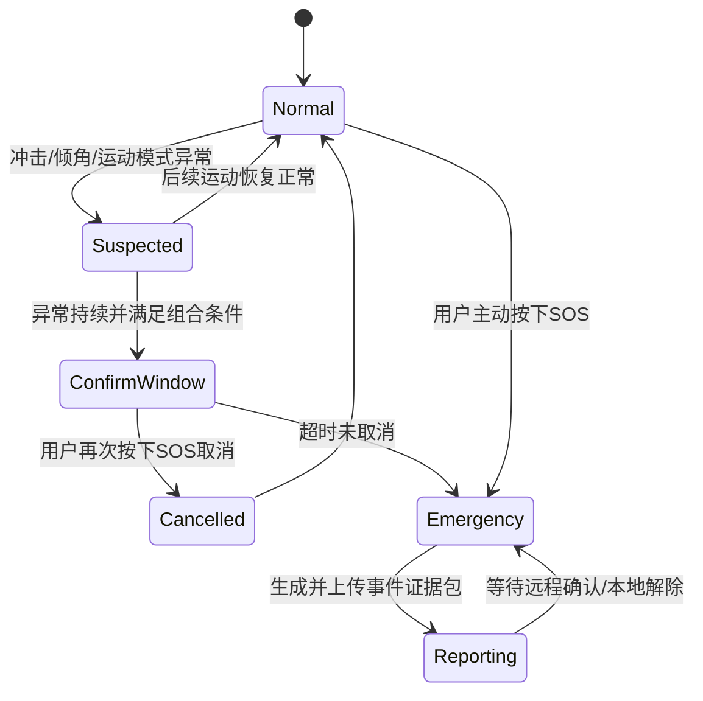

# 智能拐杖硬件现状与下一阶段特色方案

> 方案名称：**“安迹 SafeTrace”——自适应避障、二阶段异常确认与事件证据包智能拐杖**  
> 编写依据：当前 `SmartCane` 代码、已完成的单模块 Demo、现有上位机和项目初步计划。  
> 方案原则：优先用好现有 ESP32-S3-CAM，不把新增 STM32、电机、云台、4G 或心率血氧作为主线成立的前提。

## 1. 结论先行

当前硬件已经足够完成一个结构完整的智能拐杖原型，没有必要为了“看起来复杂”立即增加 STM32。现阶段最值得投入的方向不是继续堆模块，而是把已有的超声波、IMU、GPS、摄像头、光照和 SOS 按键组织成一套可靠、可解释、能远程确认的安全流程。

建议把项目定位从常见的“测到障碍就响、拐杖倒了就报警”，提升为：

> **平时根据距离变化和使用状态进行低干扰避障；出现疑似跌倒或 SOS 时先进行本地确认，随后把触发原因、传感器时间线、最后有效位置和现场图片组合为一个事件证据包，交给家属判断。**

这条主线同时保留了课程设计需要的基本功能，又有四个能真正讲清楚的特色：

1. 避障由固定距离阈值升级为“距离 + 接近速度 + 数据可信度”的自适应风险；
2. 跌倒不直接等于报警，而是经过疑似异常、用户确认窗口和最终告警；
3. 摄像头不是持续监控，而是异常触发、按需取证，兼顾隐私和资源；
4. 远程端收到的不只是一个 `FALL` 字符串，而是一份包含原因、位置、图像和时间线的可解释事件。

## 2. 当前硬件和代码的真实情况

### 2.1 已由代码和 Demo 确认的硬件

| 模块 | 当前实际型号/资源 | 接口与引脚 | 当前代码能力 | 后续可直接利用的数据 |
|---|---|---|---|---|
| 主控 | GOOUUU ESP32-S3-CAM | 双核 ESP32-S3，工程配置为 8 MB Flash、OPI PSRAM | Arduino/PlatformIO、Wi-Fi、HTTP、FreeRTOS基础同步 | 系统调度、网络、算法和图传 |
| 摄像头 | OV2640 | 固定并行相机总线，GPIO4～18中的多个引脚已占用 | VGA/QVGA JPEG、单张抓拍、MJPEG流 | 异常现场图像、远程查看 |
| 前向测距 | HC-SR04 2021 UART/IIC版 | I2C `0x57`，GPIO41/42 | 非阻塞触发，130 ms后读取，过滤2～500 cm异常值 | 距离、距离变化率、接近时间 |
| IMU | **JY901S**，不是计划表中的MPU6050 | UART1，RX39/TX38，9600 bit/s | 加速度、角速度、欧拉角，0x55帧校验 | 运动强度、冲击、倾角、静止程度 |
| GNSS | ATGM336H | UART2，RX47/TX21，9600 bit/s | 校验并解析RMC/GGA | 经纬度、速度、海拔、卫星数、UTC |
| 光照 | BH1750/GY-302 | I2C `0x23`或`0x5C` | 连续高分辨率照度读取 | 环境照度、夜间模式依据 |
| OLED | SSD1306 128×64 | I2C `0x3C` | 显示告警、距离、照度、GPS和IP | 本地状态与故障提示 |
| 求助输入 | SOS按键 | GPIO40，高电平按下 | 按下触发；锁存告警时再次按下解除 | 主动求助、异常取消/确认 |
| 本地输出 | 有源蜂鸣器 | GPIO1，经MOS驱动 | 多种非阻塞蜂鸣节奏 | 避障、确认提示、紧急报警 |
| 照明输出 | LED/照明灯 | GPIO14 | 自动/手动开关、告警闪烁 | 夜间照明、异常示警 |
| 电脑上位机 | Python + PyQt5 | CH340串口 + Wi-Fi | 传感器显示、命令、MJPEG、GPS地图、轨迹导入 | 联调、展示和看护端原型 |

### 2.2 当前已经打通的软件链路

```text
传感器驱动
  → SensorSnapshot统一快照
  → 参考告警/跌倒接口
  → OLED、蜂鸣器、照明
  → SC1串口JSON / HTTP状态
  → Windows上位机、摄像头图传和GPS地图
```

当前各接口已经能独立工作，但以下部分仍属于后续开发：

- 正式的FreeRTOS任务划分；
- 传感器滤波、特征提取和融合；
- 经数据标定的跌倒算法；
- 产品级主状态机；
- 互联网远程通知和事件存储。

### 2.3 计划中出现、但当前代码不能证明已经具备的硬件

| 项目 | 当前判断 | 对方案的处理 |
|---|---|---|
| 震动马达 | `BoardConfig.h`中没有控制引脚和驱动 | 不写成已实现功能；以后可由MOS管增加一个GPIO输出 |
| 电池电压检测 | 没有ADC分压引脚和采样代码 | 暂不设计“低电量状态”，除非先补硬件采样回路 |
| 心率/血氧 | 没有对应传感器和驱动 | 作为增强项，不进入主线验收 |
| 摄像头云台 | 没有舵机、电机驱动和已验证空闲引脚 | 不作为当前方案组成，不为它新增STM32 |
| 4G Cat.1 | 没有模块、供电、串口和通信栈 | 只保留未来“事件小包上传”，不承诺4G实时图传 |
| SD卡/大容量存储 | 当前代码没有SD接口 | 图片不长期写Flash；事件应尽快上传，离线只短期保存在PSRAM |
| 独立STM32 | 当前没有必要 | 只有确实增加多电机闭环控制后才重新评估 |

### 2.4 当前配置与原计划的差异

1. 原计划写MPU6050，实物和驱动实际为JY901S；报告、PPT和原理图应统一改为JY901S。
2. 原计划写震动马达联动，当前代码只有蜂鸣器和LED，不能把震动写成已完成。
3. 原计划目标超声波刷新率不低于5 Hz，当前间隔为220 ms，约4.5 Hz；若实测稳定，可调整至200 ms。
4. 原计划要求跌倒后2 s内报警，当前参考流程的冲击后确认时间为2.5 s，正式算法需要重新设计和验收。
5. 当前工程配置为8 MB Flash和OPI PSRAM，计划采购描述中出现N16R8；必须读取实机Flash/PSRAM容量后再在材料中写死型号。

## 3. 现有硬件的能力边界

### 3.1 为什么现在不需要增加STM32

ESP32-S3本身是双核处理器，ESP-IDF FreeRTOS提供任务绑核接口，足够把传感器/决策与网络图传分开调度。当前控制对象只有蜂鸣器、照明和按键，没有多路高速电机闭环、编码器采样或严格微秒级控制，因此增加第二颗MCU只会新增通信协议、供电、PCB和联调成本。

官方资料也确认ESP32-S3支持双核和FreeRTOS任务绑核；相机驱动原生支持ESP32-S3与OV2640。工程应先用队列、快照和任务优先级解决资源竞争，而不是先用第二颗MCU回避软件架构问题。

只有同时满足以下条件时，才值得重新考虑STM32：

- 新增两个以上电机/舵机并要求稳定闭环；
- 需要编码器、FOC或高频PWM采样；
- 图传压力下ESP32-S3无法满足已量化的控制截止时间；
- 已完成任务运行时间、栈余量和CPU占用测试，确认瓶颈确实来自算力而非阻塞代码。

### 3.2 必须承认的限制

- 单个前向超声波只知道一个方向的距离，不能可靠识别坑洞、台阶边缘、侧面障碍或障碍物类别。
- IMU装在拐杖上，测到的是“拐杖运动”，不是人体本身；拐杖靠墙、掉落或剧烈挥动都可能像跌倒。
- GPS主要适合室外；室内无定位时只能提供最后一次有效位置，不能伪造当前位置。
- Wi-Fi AP模式只能实现设备附近的本地看护；真正跨互联网远程看护需要设备接入路由器或手机热点，并连接服务器。
- 摄像头和Wi-Fi对供电及PSRAM敏感。Espressif相机驱动说明指出，除CIF及以下JPEG等情况外通常需要启用PSRAM；高分辨率、双帧缓冲会增加CPU和内存压力。
- 没有SD卡时不能把大量JPEG长期写入本地；频繁写内部Flash还会带来寿命和阻塞风险。

这些限制不是项目失败点。恰当的创新是“在限制内做可靠决策”，而不是把一个前向摄像头包装成全场景自动驾驶。

## 4. 建议确定的产品方案

### 4.1 方案名称与一句话介绍

**安迹 SafeTrace：面向独立出行的事件驱动型智能看护拐杖。**

> 它平时根据障碍接近风险进行低干扰提醒；异常时通过IMU、用户反馈、GPS和摄像头进行二阶段确认，并生成可解释的远程事件证据包。

### 4.2 基本功能层：保证它首先是一根“好用的智能拐杖”

| 基本功能 | 实现方式 | 当前基础 | 下一步工作 |
|---|---|---|---|
| 前向避障 | 超声波距离、滤波、分级蜂鸣 | 驱动和参考阈值已有 | 增加中值滤波、滞回和动态风险 |
| 夜间照明 | BH1750低照度自动开灯 | 已打通 | 增加滞回，避免临界照度闪烁 |
| 主动SOS | 按键立即锁存求助 | 已打通 | 加入事件包和远程确认 |
| 本地异常报警 | 蜂鸣器、LED节奏 | 已打通 | 由正式状态机统一输出 |
| GPS位置 | ATGM336H定位、地图显示 | 已打通 | 保存最后有效位置和定位质量 |
| 现场图像 | OV2640抓拍/MJPEG | 已打通 | 改为正常低负载、异常按需抓拍/图传 |
| 本地/电脑显示 | OLED、上位机 | 已打通 | 增加事件时间线和健康状态 |

### 4.3 核心创新一：自适应避障风险，而不是只有固定距离

常见项目只判断“距离是否小于50 cm”。本方案在不增加硬件的情况下，增加距离趋势：

```text
接近速度 v_close = max(0, (上次距离 - 当前距离) / 时间差)
预计碰撞时间 TTC = 当前距离 / v_close
```

风险判断同时使用：

- 当前距离；
- 障碍物是否正在快速接近；
- 最近若干次测距是否稳定；
- IMU判断当前是静止、正常行走还是剧烈晃动；
- GPS速度只作为室外低权重参考，不作为近距离避障主依据。

效果示例：

- 站着不动、障碍在80 cm处：只进行低频提示；
- 正向快速接近、障碍仍有120 cm：因为TTC变小，可以提前提醒；
- 测距连续无效：不输出虚假“安全”，而是提示避障传感器不可用。

这比增加第二个蜂鸣器或多写几个固定阈值更有实际意义，也能形成清晰的算法对比实验。

### 4.4 核心创新二：二阶段异常确认，降低跌倒误报

当前拐杖IMU无法直接证明“人跌倒”，因此状态机不应从一次冲击直接跳到远程报警。建议流程：



建议的异常判断输入：

- 加速度模长及峰值；
- 三轴角速度峰值；
- 横滚/俯仰角和持续时间；
- 冲击后的低运动方差或长时间静止；
- 拐杖是否很快恢复正常姿态；
- 用户是否在确认窗口内取消。

建议把“拐杖慢慢靠墙”作为必须加入数据集的负样本，而不是继续调一个万能倾角阈值。

### 4.5 核心创新三：异常事件证据包

确认SOS或异常后，不只发送“跌倒了”，而是生成一个 `CareEvent`：

| 内容 | 建议字段/形式 | 价值 |
|---|---|---|
| 事件身份 | `event_id`、类型、设备运行时间、UTC | 区分重复报警和重连 |
| 可解释原因 | 冲击峰值、倾角、静止时长、用户是否取消 | 家属知道为什么报警 |
| 传感器时间线 | 事件前10 s、后20 s的低频特征 | 复盘误报、后续改算法 |
| 位置 | 当前或最后有效经纬度、卫星数、定位年龄 | 不把无效GPS当真位置 |
| 现场图像 | 1～3张JPEG；必要时再开启MJPEG | 减少带宽并保护隐私 |
| 设备健康 | IMU、超声波、GPS、相机在线状态 | 区分“异常”与“设备坏了” |

实现建议：

- 传感器特征使用固定长度环形缓冲，优先放在内部RAM；
- PSRAM充足时可保留少量低频JPEG，PSRAM不足则只在事件发生时抓拍；
- 事件元数据可低频写NVS，图片不要反复写内部Flash；
- 上传失败时在PSRAM保留最近一份事件，恢复网络后重试；设备掉电后图片丢失属于当前无SD卡方案的明确限制。

### 4.6 核心创新四：隐私友好的按需图传

普通“摄像头拐杖”往往默认持续直播。本方案建议：

- 正常状态：不开远程上传，或只提供用户主动访问的低帧率本地画面；
- 疑似异常：抓拍一张供状态机记录，不立即对外持续推流；
- 确认异常/SOS：上传事件图片，并允许看护端主动打开实时流；
- 告警解除：停止异常推流，回到低负载模式。

这样既降低相机和Wi-Fi对主循环的压力，也能把“隐私保护”写成真实的系统设计，而不是宣传词。

### 4.7 工程特色：健康自检和降级运行

真正可靠的产品不只显示数值，还要知道数据是否可信。当前代码已经有 `valid` 和数据超时基础，可以继续形成：

- 超声波失效：关闭基于距离的自动判断，明确提示“避障不可用”；
- IMU失效：保留SOS和避障，关闭自动跌倒判断；
- GPS无定位：上传最后有效位置及其时间，不显示伪坐标；
- 相机失效：事件仍发送传感器和位置，不让图像失败阻塞本地报警；
- Wi-Fi断开：本地避障、照明和告警继续运行，网络恢复后重报事件。

“故障时仍保留部分能力”比简单显示一个 `offline` 更有工程价值，也适合在答辩中演示拔掉某个模块后的系统行为。

## 5. 不增加STM32的FreeRTOS架构建议

### 5.1 任务划分

| 任务 | 建议周期/触发 | 建议优先级 | 建议核心 | 职责 |
|---|---|---:|---|---|
| `SensorTask` | 5～10 ms轮询，设备按各自周期采样 | 5 | Core 1 | 消费IMU/GPS串口、调度超声波和光照、生成原始快照 |
| `DecisionTask` | 20～50 ms | 4 | Core 1 | 滤波、特征、自适应避障、异常检测和主状态机 |
| `ActuatorTask` | 10～20 ms | 3 | Core 1 | 根据唯一控制指令更新蜂鸣器和LED，不自行判断状态 |
| `EventTask` | 队列事件触发 | 3 | 不先强制绑核 | 组装CareEvent、触发抓拍、安排重试 |
| `TelemetryTask` | 200 ms | 2 | Core 0或不绑核 | 串口/HTTP状态快照发布 |
| 摄像头/HTTP | 请求或事件触发 | 使用驱动任务 | 先沿用框架默认 | MJPEG、抓拍和网页请求 |

不建议一开始把所有网络和相机代码都手工钉死在Core 0。ESP-IDF自身已有Wi-Fi、事件循环和HTTP相关任务；应先固定传感器与决策在Core 1，测量任务运行时间和看门狗情况，再决定是否进一步绑核。

### 5.2 任务间只传数据，不互相操作硬件

建议使用三类通道：

```text
SensorSnapshotQueue（长度1，覆盖旧值）
  SensorTask → DecisionTask

ControlCommandQueue
  DecisionTask → ActuatorTask

CareEventQueue
  DecisionTask/SOS → EventTask → Camera/Network
```

基本规则：

- 只有 `SensorTask` 访问传感器驱动；
- 只有 `ActuatorTask` 写蜂鸣器和LED；
- `DecisionTask` 只读快照、输出状态和命令；
- HTTP回调只入队，不直接修改状态机；
- 上位机读取的是发布快照，不读取正在变化的内部对象。

主控制入口仍放在 `src/app/SmartCaneApp.cpp`，任务句柄和队列声明放在 `SmartCaneApp.h`；算法较大后再拆到 `src/algorithm/`，状态机拆到 `src/control/SystemStateMachine.*`。

## 6. 状态机应避免“状态爆炸”

原计划把夜间、避障、跌倒、SOS、低电量都列为主状态，但它们可以同时发生。例如夜间也可能遇到障碍，Wi-Fi断开时也可能SOS。建议拆成三组正交状态：

### 6.1 安全主状态

```text
NORMAL
OBSTACLE_CAUTION
OBSTACLE_DANGER
SUSPECTED_FALL
CONFIRM_WINDOW
EMERGENCY
```

### 6.2 独立模式

- `LightMode`：AUTO / ON / OFF；
- `NetworkState`：OFFLINE / AP / STA_LOCAL / INTERNET_READY；
- `HealthFlags`：SONAR、IMU、GPS、CAMERA等在线位；
- `GpsState`：NO_DATA / NO_FIX / FIX / STALE_FIX。

这样 `EMERGENCY + OFFLINE + AUTO_LIGHT` 可以同时存在，不需要为每种组合再创造一个枚举状态。

## 7. 算法实施建议

### 7.1 先做可解释特征，不急着上神经网络

建议先保存带标签的JY901S数据：正常行走、上下楼、快速挥动、拐杖掉落、靠墙、坐下、模拟跌倒。每个滑动窗口提取：

- 加速度模长均值、方差、最大值、最小值；
- 三轴角速度峰值和能量；
- 横滚/俯仰变化量和持续倾角；
- 冲击前后静止程度；
- 事件持续时间。

第一版使用规则、逻辑回归、小型决策树或随机森林离线训练后导出常量，比直接在摄像头上跑大模型更容易形成可靠结果和对比实验。

### 7.2 TinyML作为后期加分项，不作为主线前置条件

ESP32-S3具有面向AI/DSP的向量指令，Espressif也提供ESP-DL推理库，因此后期可以尝试小型量化模型。但ESP-DL官方流程主要基于ESP-IDF，当前工程使用Arduino框架；迁移成本、模型转换、PSRAM和相机资源竞争都需要单独评估。

推荐优先级：

1. 先完成可解释规则和数据集；
2. 用相同测试集比较规则与轻量分类器；
3. 只有离线模型明显更好，再考虑量化部署；
4. 暂不承诺仅靠现有单摄像头完成坑洞/楼梯/盲道识别。

## 8. 远程看护的可落地路径

### 8.1 当前即可完成：近距离或同局域网看护

- ESP32建立AP，手机/电脑连接设备热点；
- 或ESP32和看护端连接同一路由器；
- 浏览器/上位机查看状态、地图和MJPEG；
- 异常时在本地网络内自动显示事件。

### 8.2 不增加硬件的实用升级：手机热点作为网关

让ESP32以STA模式连接使用者手机热点，事件通过HTTPS/MQTT发送到轻量服务器，看护者通过手机网页接收通知。这样不需要4G模块，但必须明确：

- 使用者手机需要开热点并有互联网；
- ESP32需要配置热点凭据；
- 服务器只传事件元数据和少量JPEG，实时视频按需打开；
- 网络不可用时，本地安全功能必须照常工作。

### 8.3 未来4G扩展

如果后期确实需要脱离手机独立联网，4G Cat.1只负责：

- SOS/异常事件JSON；
- GPS位置；
- 1张压缩JPEG或图片下载地址。

不建议把4G实时视频作为课程设计硬指标，它会显著增加功耗、资费、天线、供电和网络调试风险。

## 9. 分阶段实施路线

### 阶段0：冻结并核实硬件

- 实机输出Flash容量、PSRAM容量和剩余堆；
- 确认摄像头开启时5 V电源无复位；
- 统一报告中的JY901S型号；
- 明确震动马达、电池检测和4G均不在当前验收范围。

### 阶段1：完成可靠的基本功能

- 建立FreeRTOS任务、队列和唯一硬件访问者；
- 超声波中值滤波、滞回和传感器超时；
- 完成本地避障、夜间照明、SOS、GPS和图传；
- 网络断开时验证本地功能不受影响。

### 阶段2：实现SafeTrace核心主线

- 加入距离变化率/TTC风险；
- 实现疑似跌倒、确认窗口、取消和紧急状态；
- 建立传感器特征环形缓冲；
- 生成包含原因、位置、健康状态和JPEG的CareEvent；
- 上位机增加事件时间线和确认页面。

### 阶段3：完成远程看护演示

- ESP32连接路由器或手机热点；
- 事件JSON和JPEG上传；
- 看护端展示事件、地图、图片及实时流入口；
- 完成断网重试和重复事件去重。

### 阶段4：有余力再做的增强

- 基于真实数据训练轻量IMU分类器；
- 加入震动马达，但仍由ESP32直接控制；
- 评估心率血氧是否真的改善异常判断；
- 只有明确需要多电机闭环时才研究云台和第二MCU。

## 10. 建议验收指标

以下为下一阶段建议指标，不代表当前代码已经达到：

| 类别 | 建议验收方法 | 建议目标 |
|---|---|---|
| 避障刷新 | 连续记录有效距离时间戳 | 稳定不低于5 Hz |
| 避障响应 | 障碍进入危险区到本地提醒 | 小于300 ms |
| 图传干扰 | 同时开启VGA/QVGA图传并记录传感器间隔 | 传感器不连续超时，控制不被阻塞 |
| 异常响应 | 冲击/倾倒到进入确认窗口 | 小于1 s |
| 最终求助 | 确认窗口超时或主动SOS到本地紧急报警 | 小于200 ms |
| 跌倒误报 | 正常行走30 min、靠墙/放下各50次 | 先建立基线，再按数据迭代降低误报 |
| GPS可信度 | 室内、室外、刚失去定位分别测试 | 明确区分无定位、有效定位和过期位置 |
| 断网降级 | 图传中断、路由器断开 | 避障、照明、SOS本地功能继续运行 |
| 故障隔离 | 分别拔掉一个传感器 | 其余功能继续运行且界面明确提示 |
| 资源稳定性 | 连续运行2 h，记录最小堆和复位原因 | 无看门狗复位、无持续内存下降 |

## 11. 建议在答辩中强调的创新点

不要把创新总结为“用了ESP32、装了很多传感器”。建议表述为：

1. **风险自适应避障**：使用距离趋势和预计碰撞时间，区别于固定阈值蜂鸣；
2. **二阶段异常确认**：把“拐杖异常”与“人员真实求助”分开，针对靠墙误报设计确认窗口；
3. **多模态事件证据链**：一次事件同时包含IMU原因、距离、定位、设备健康和现场图像；
4. **隐私友好图传**：正常状态不主动上传，异常后按需抓拍和远程查看；
5. **单主控可靠调度**：利用ESP32-S3双核和FreeRTOS完成感知、决策、控制、图传与网络协同；
6. **故障降级设计**：单个传感器或网络故障时保留基本安全能力。

## 12. 不建议现在做的事情

- 不为了“分工”或“看起来高级”增加STM32；
- 不在基本功能未稳定前增加摄像头云台；
- 不把心率血氧值简单等同于健康诊断；
- 不承诺当前单超声波和单摄像头能可靠识别所有坑洞、楼梯和盲道；
- 不把Wi-Fi AP描述为互联网远程看护；
- 不使用内部Flash循环保存大量JPEG；
- 不先写复杂神经网络，再补数据集和测试标准。

## 13. 最终建议

项目下一阶段应围绕以下一条主线推进：

> **先用现有硬件完成稳定避障、SOS、GPS和按需图传；再通过FreeRTOS任务化、二阶段异常确认和CareEvent事件证据包形成特色。心率血氧、震动、云台、4G和视觉AI全部作为可选增强，不影响主线验收。**

这个方案的优势是：硬件改动小、与现有代码衔接直接、演示效果清晰、论文中有算法和系统架构可写，也能坦诚处理GPS、Wi-Fi和拐杖IMU的物理限制。

## 14. 官方技术依据

- [Espressif ESP32-S3数据手册：双核处理器及AI/DSP向量指令](https://documentation.espressif.com/esp32-s3_datasheet_en.pdf)
- [ESP-IDF FreeRTOS扩展：`xTaskCreatePinnedToCore`任务绑核接口](https://docs.espressif.com/projects/esp-idf/en/stable/esp32s3/api-reference/system/freertos_additions.html)
- [Espressif官方esp32-camera驱动：OV2640、PSRAM与帧缓冲说明](https://github.com/espressif/esp32-camera)
- [Espressif ESP-DL文档：ESP32-S3轻量推理能力](https://docs.espressif.com/projects/esp-dl/en/release-v1.1/esp32s3/index.html)
