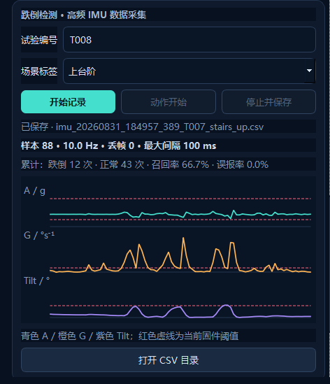
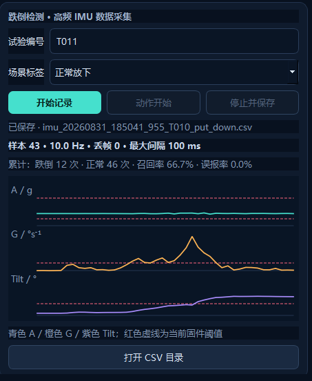
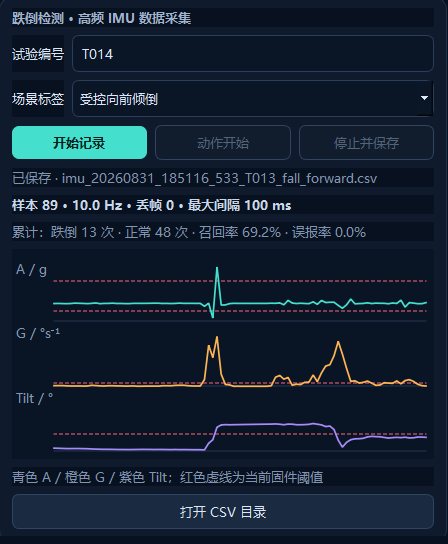
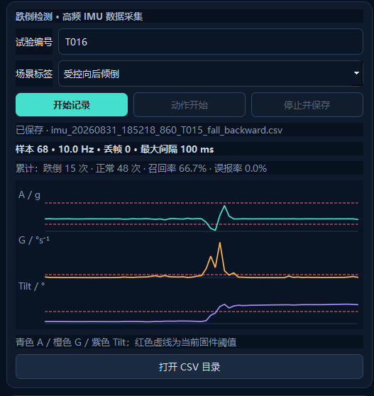

# 智能拐杖 IMU 跌倒检测验收说明

## 1. 验收结论

本目录归档了 JY901S IMU 接入、高频串口采集、阈值标定、状态机离线重放、固件实现和冻结参数独立验证的相关材料。

冻结参数后的独立验收共取得 17 份原始记录。其中 1 份后向倾倒记录在动作完成前停止，按预先定义的数据完整性规则标记为无效，并保留原文件；其后重新完成后向倾倒测试。因此最终有效验收集为：

- 正常动作：12 次，误报 0 次；
- 模拟跌倒：4 次，检出 4 次；
- 有效集混淆矩阵：TP=4、FN=0、FP=0、TN=12；
- 本轮受控场景召回率：100%；
- 本轮受控场景误报率：0%；
- 前向倾倒进一步完成了 `SUSPECTED_FALL → FALL` 的约 4 秒确认和锁存验证；
- 严格冲击路径与深度失重路径均在实机数据中得到验证。

据此，当前实现满足课程设计/工程原型的 IMU 跌倒检测交付要求。该结论仅适用于本机、当前安装方式和受控场景，不代表医疗或真实人群安全认证结果。

## 2. 最终冻结参数

参数定义见 `04-固件关键代码/UserConfig.h`。

| 参数 | 冻结值 | 作用 |
|---|---:|---|
| `FALL_FREE_FALL_G` | 0.55 g | 普通低重力候选入口 |
| `FALL_DEEP_FREE_FALL_G` | 0.40 g | 未采到冲击峰值时的深度失重入口 |
| `FALL_IMPACT_G` | 2.20 g | 严格路径冲击阈值 |
| `FALL_TILT_DEG` | 55° | 横滚或俯仰倾斜阈值 |
| `FALL_STILL_GYRO_DPS` | 45°/s | 倾倒后静止角速度上限 |
| `FALL_TILT_HOLD_MS` | 600 ms | 严格路径持续保持时间 |
| `FALL_DEEP_TILT_HOLD_MS` | 1200 ms | 深度失重路径持续保持时间 |
| `FALL_SEQUENCE_WINDOW_MS` | 2000 ms | 候选动作总窗口 |
| `SUSPECTED_FALL_CONFIRM_MS` | 4000 ms | 疑似跌倒转锁存跌倒等待时间 |
| `FALL_CANCEL_COOLDOWN_MS` | 3000 ms | 取消后的重复触发抑制时间 |

最终规则包含两条路径：

1. 严格路径：低重力或冲击进入候选，必须采到不低于 2.20 g 的冲击，随后倾角不低于 55°、合角速度不高于 45°/s，并连续保持 600 ms。
2. 深度失重路径：若采到不高于 0.40 g 的深度失重，即使 10 Hz 数据未采到冲击峰值，也可在相同倾斜和静止条件连续保持 1200 ms 后确认。

任一路径确认后先进入 `SUSPECTED_FALL`，4 秒内允许取消；未取消则锁存为 `FALL`。

## 3. 数据采集与调试过程

Qt 上位机通过 USB-TTL 接收固件输出的 `SC1 IMU` CSV。固件只在收到 JY901S 新样本时输出记录，实际采样率约 10 Hz；跌倒状态机在 ESP32 决策任务中每 20 ms 更新一次。

每条 CSV 包含：

- PC 时间、设备时间、试验编号、场景标签和真实标签；
- 三轴加速度、三轴角速度、横滚角、俯仰角和航向角；
- `A`、`G`、`Tilt` 三个派生量；
- 候选阶段、低重力、冲击、倾斜静止状态；
- `NORMAL`、`SUSPECTED_FALL`、`FALL` 告警状态；
- 序号、采样率、丢帧和最大间隔统计。

共进行了四个阶段：

| 阶段 | 文件数 | 用途 | 结果说明 |
|---|---:|---|---|
| 第1轮 | 16 | 初始场景采集 | 12 个正常场景和 4 个方向倾倒 |
| 第2轮 | 16 | 重复动作并暴露漏检 | 发现 10 Hz 下冲击峰值可能漏采 |
| 第3轮 | 16 | 双路径候选参数验证 | 发现前向倾倒最低加速度 0.3823 g，推动深度阈值冻结为 0.40 g |
| 第4轮 | 17 | 冻结参数独立验收 | 16 条有效记录全部通过，另有 1 条中止记录保留并重测 |

前三轮共 48 条记录参与了参数分析。最终参数对前三轮数据进行离线重放后，12 次模拟跌倒均检出，36 次正常动作均未误报。第4轮用于冻结参数后的实机独立验收。

## 4. 独立验收结果

第4轮原始数据位于 `01-采集数据/第4轮-冻结参数独立验收/`。

### 4.1 正常场景

以下 12 个场景均未进入 `SUSPECTED_FALL`：

1. 静止直立；
2. 正常行走；
3. 快速行走；
4. 大幅摆杖；
5. 左转；
6. 右转；
7. 上台阶；
8. 下台阶；
9. 靠墙放置；
10. 正常放下；
11. 正常拿起；
12. 杖尖碰撞。

其中快速行走最低加速度达到 0.4611 g、最高加速度达到 2.0322 g，曾进入普通候选阶段，但没有满足冲击确认和倾斜静止保持条件，因此未误报。正常放下和拿起的最大倾角分别达到约 91° 和 96°，但没有低重力/冲击事件链，也未误报。

### 4.2 模拟跌倒

| 方向 | 文件 | 触发路径 | 结果 |
|---|---|---|---|
| 前向 | `imu_20260831_185116_533_T013_fall_forward.csv` | 严格/双重保持 | 进入疑似跌倒，并在约 4 秒后锁存 `FALL` |
| 后向 | `imu_20260831_185218_860_T015_fall_backward.csv` | 深度失重路径 | 进入疑似跌倒 |
| 左向 | `imu_20260831_185239_500_T016_fall_left.csv` | 深度失重路径 | 进入疑似跌倒 |
| 右向 | `imu_20260831_185307_771_T017_fall_right.csv` | 严格/双重保持 | 进入疑似跌倒；仅丢 1 帧，不影响结果 |

### 4.3 无效记录说明

`imu_20260831_185152_141_T014_fall_backward.csv` 为一次中止记录：

- 总记录时长仅 2.59 秒；
- 动作真正开始后约 200 ms 即停止保存；
- 最后倾角仅 45.43°，未达到冻结阈值 55°；
- 没有记录到落地后的静止保持段；
- 因此该文件不具备判定算法检出或漏检的完整条件。

该文件未被删除，保留用于审计；随后重新完成的后向倾倒记录为 `T015`，并通过深度失重路径触发。

## 5. 验收截图

### 5.1 正常上台阶



### 5.2 正常放下



### 5.3 前向跌倒



### 5.4 后向跌倒



## 6. 离线重放与网格扫描

`03-离线分析工具/` 保存了状态机重放器、网格扫描入口、测试和一份独立的 CSV 副本。

重放器不是简单按 10 Hz 的 CSV 行判断，而是在相邻样本之间保持上一帧，并按固件的 20 ms 决策周期更新状态机，从而复现持续保持时间和序列窗口。

在 `03-离线分析工具` 目录运行：

```powershell
python fall_grid_search.py
python -m pytest tests\test_fall_replay.py -q
```

工具目录中的 `imu_captures` 是64条有效记录的分析副本；排除项及理由见 `03-离线分析工具/EXCLUSIONS.md`。被排除的原始文件仍保存在第4轮原始数据目录中。

最终参数重放结果：

- 前三轮：TP=12、FN=0、FP=0、TN=36；
- 加入第4轮16条有效数据后：模拟跌倒 16/16 检出，正常动作 48/48 未误报；
- 第4轮中止记录不参与有效集统计。

## 7. 目录结构

```text
IMU跌倒检测验收/
├─ README.md
├─ 01-采集数据/
│  ├─ trials.csv
│  ├─ 第1轮-初始采集/
│  ├─ 第2轮-重复采集/
│  ├─ 第3轮-候选参数/
│  └─ 第4轮-冻结参数独立验收/
├─ 02-验收截图/
├─ 03-离线分析工具/
├─ 04-固件关键代码/
├─ 05-Qt上位机采集代码/
├─ 06-串口日志/
├─ 07-最终固件/
└─ 08-参考文档/
```

各目录内容如下：

- `01-采集数据`：全部原始 IMU CSV 和汇总表，不修改原始测量值；
- `02-验收截图`：正常动作与跌倒触发的 Qt 曲线截图；
- `03-离线分析工具`：状态机重放、参数扫描、测试和可直接运行的数据副本；
- `04-固件关键代码`：JY901S 驱动、双路径跌倒检测、最终配置和串口输出代码；
- `05-Qt上位机采集代码`：串口协议解析、CSV 采集、实时曲线和相关测试；
- `06-串口日志`：调试期间保存的原始上位机串口日志；
- `07-最终固件`：最终 ESP32-S3 `firmware.bin` 和 PlatformIO 配置；
- `08-参考文档`：通信协议、控制逻辑、FreeRTOS 联调和跌倒调试文档。

## 8. 构建与测试状态

- Qt/离线工具自动测试：21 项通过；
- PlatformIO 环境：`esp32-s3-cam`；
- 固件构建：成功；
- RAM 使用率：16.8%；
- Flash 使用率：51.4%；
- 串口 IMU 采样：约 10 Hz；
- 最终验收有效记录：全部有动作标记，无序列重置；右向倾倒仅出现 1 帧丢失。

## 9. 交付表述建议

建议在课程报告中使用以下表述：

> 冻结参数后完成一轮独立受控场景验证，共获得 16 组有效记录，包括 12 组正常动作和 4 组四方向模拟跌倒。正常动作均未触发跌倒报警，四方向模拟跌倒均进入疑似跌倒状态，其中前向试验进一步验证了 4 秒确认及 `FALL` 锁存流程。另有 1 次后向试验因记录在动作完成前停止而作废，随后重新测试通过。本系统已满足课程设计原型的跌倒检测交付要求。

不要将本轮结果表述为面向真实人群的“准确率 100%”或安全认证结果。可表述为“本轮受控场景通过率 100%”。
