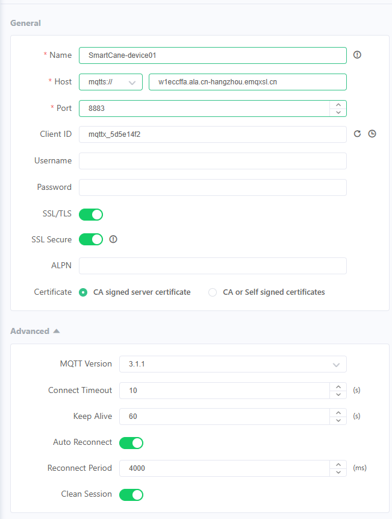
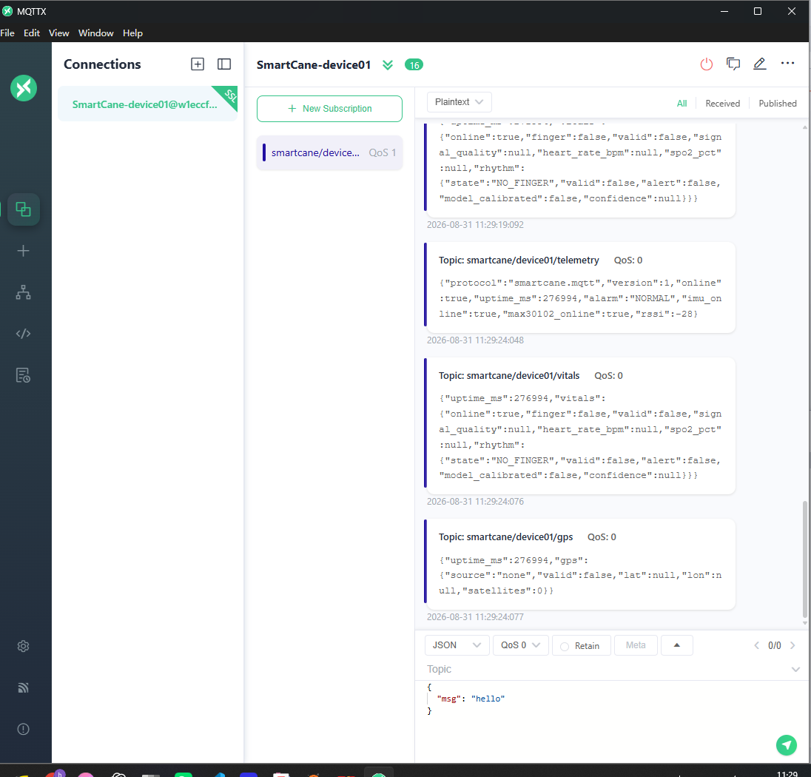
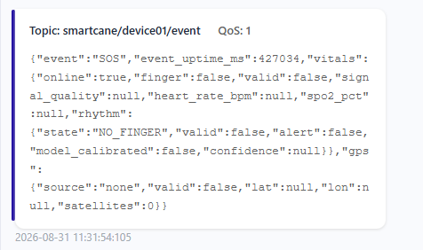
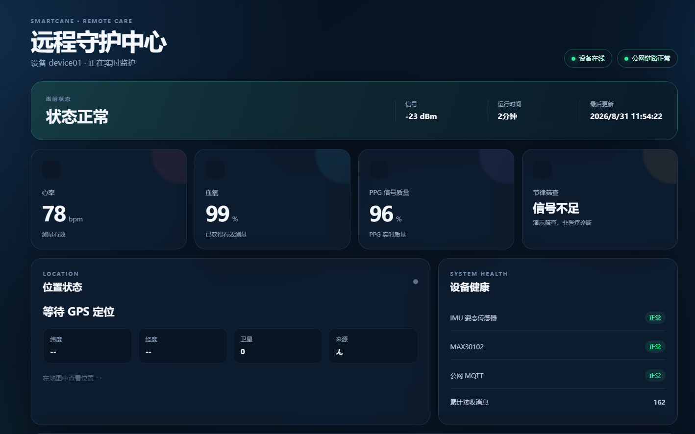
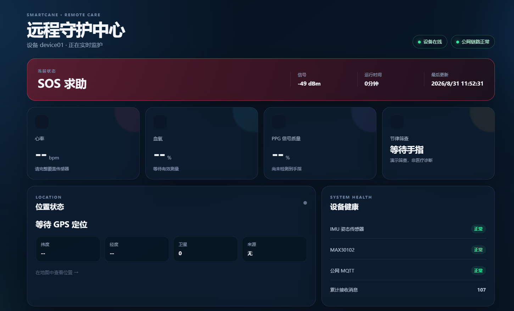

# SmartCane MQTT 公网链路调试交付包

整理日期：2026-08-31  
设备标识：`device01`  
验收范围：ESP32-S3-CAM → MQTT over TLS → MQTTX / 远程监护网页

## 1. 交付结论

本次已经完成 MQTT 公网上行主链路调试，不只是制作了一个网页和两张展示图。交付内容还包括：

- ESP32 端 MQTT over TLS 发布、NTP 校时、在线状态、自动重连与事件队列代码；
- `telemetry`、`vitals`、`gps`、`event`、`presence` 五类 Topic；
- MQTTX 的 TLS 配置、周期消息接收和 SOS 事件实测截图；
- 可运行的只读远程监护网页源码及自动化测试；
- 2026-08-31 11:24—11:51 的原始串口日志；
- PlatformIO 构建配置及固件安全交付说明；
- 脱敏配置模板、Topic 协议和复现步骤。

已有证据足以说明以下核心功能已打通：

1. 设备通过 TLS 端口 8883 连接公网 Broker；
2. MQTTX 能接收设备的周期遥测、生命体征和 GPS 消息；
3. SOS 能立即发布到 `smartcane/device01/event`，QoS 为 1；
4. 网页能从公网 MQTT 实时显示设备在线、正常状态、生命体征和 SOS；
5. 远程命令保持关闭，网页为只读监护端。

生产环境发布前仍应补做跨运营商网络、强制断网重连、遗嘱离线状态、全部事件类型和长时间稳定性测试。它们在代码中已有支持，但当前交付证据不足以声称全部实测通过。

## 2. 目录说明

| 目录 | 内容 |
|---|---|
| `01-验收截图` | MQTTX 配置、周期消息、SOS 事件、网页正常/SOS 状态 |
| `02-远程监护网页源码` | Flask + Paho MQTT + SSE 网页，含测试和启动脚本 |
| `03-固件MQTT代码` | MQTT 服务及其在主应用中的集成代码快照 |
| `04-串口日志` | MQTT 联调时的原始 TTL 串口日志和关键记录 |
| `05-协议与验收文档` | Topic 表、复现步骤、结论及未覆盖项 |
| `06-固件构建说明` | PlatformIO 构建配置及二进制凭据安全说明 |

## 3. 核心验收证据

### 3.1 MQTTX 连接及消息接收

### 3.2 SOS 事件

截图证明 `smartcane/device01/event` 收到 `event=SOS`，消息 QoS 为 1，并携带事件时刻、生命体征与 GPS 快照。

### 3.3 远程监护网页

网页正常状态截图显示心率 78 bpm、血氧 99%、PPG 质量 96%，设备和公网 MQTT 均为正常；SOS 截图显示远程页面能切换到求助状态。

## 4. 快速复现

1. 阅读 `05-协议与验收文档/MQTT调试复现与验收步骤.md`。
2. 按 `02-远程监护网页源码/.env.example` 创建本机 `.env`，填写只读 MQTT 账号。
3. 在网页源码目录运行 `run.ps1 -Install`，再运行 `run.ps1`。
4. MQTTX 订阅 `smartcane/device01/#`，确认周期消息与 SOS 事件。
5. 需要重新构建和烧录时，先阅读 `06-固件构建说明`；不要公开分发含真实 MQTT 凭据的固件二进制。

## 5. 安全说明

- 本交付包未复制主工程中的真实 `UserConfig.h`，网页 `.env` 也未纳入归档；
- 所有配置文件仅保留占位符，不能直接用于连接实际 Broker；
- Broker 域名可能出现在验收截图和原始串口日志中，但用户名、密码未写入交付文档；
- 远程命令当前为 `false`，在完成 Topic ACL、独立账号和权限限制前不要开启；
- 若交付包要公开上传，仍建议先检查截图中的 Broker 域名是否需要遮挡。

## 6. 验证记录

- 远程网页单元测试：7 项全部通过；
- 原始日志中可见 MQTT 从 `CONNECTING` 进入 `ONLINE`；
- 截图中可见 MQTTX 的周期 Topic 和 QoS 1 SOS；
- 详细边界见 `05-协议与验收文档/测试结论与未覆盖项.md`。
